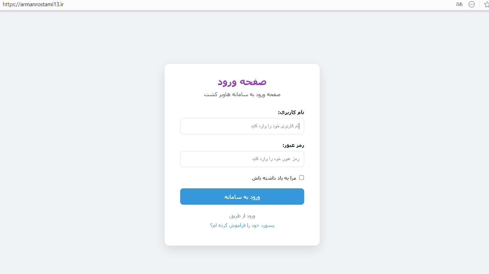
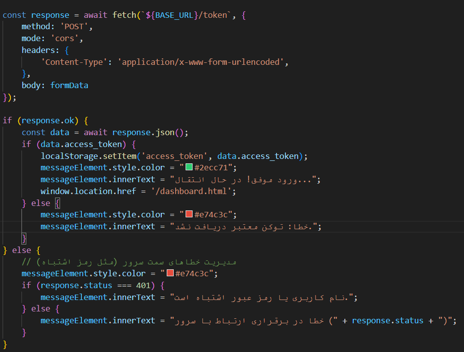
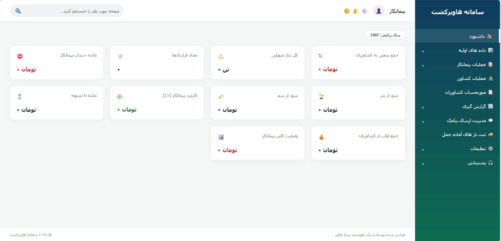
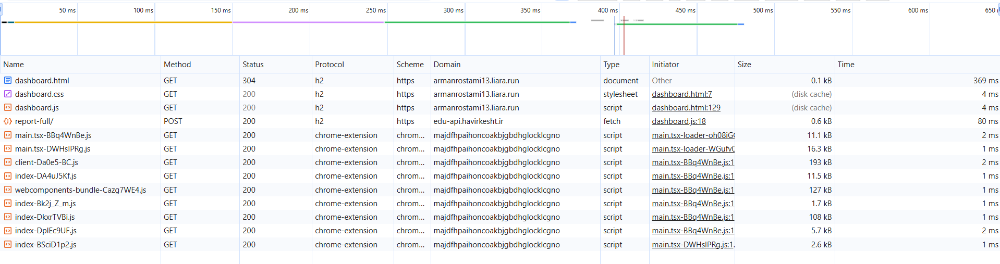
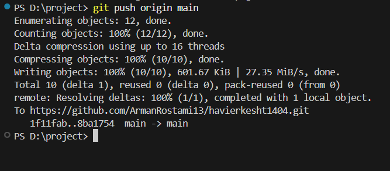
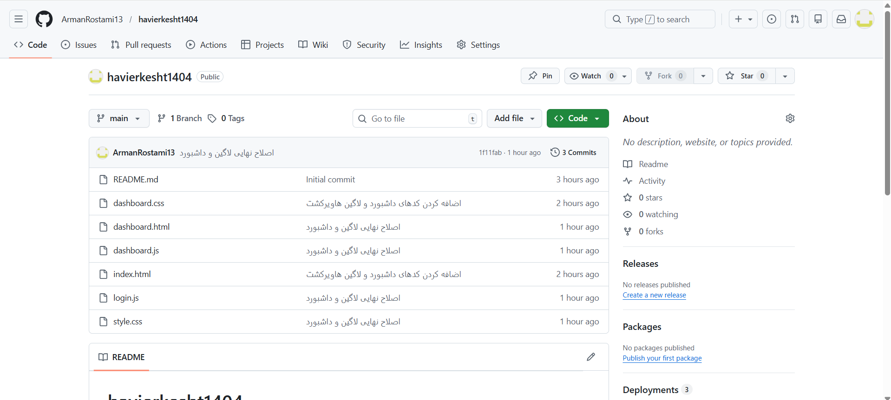
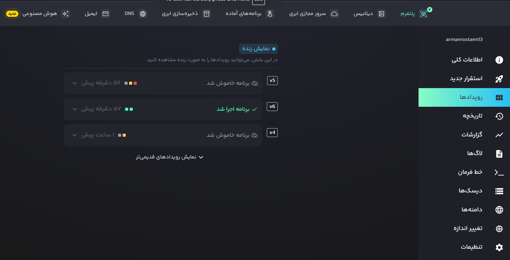

# 🌾 سامانه مدیریت کشاورزی هاویرکشت (v1.0)

این پروژه یک پنل مدیریتی هوشمند برای پیمانکاران کشاورزی است که با هدف یکپارچه‌سازی داده‌های مالی و زراعی طراحی شده است.

---

## 🚀 گزارش مراحل توسعه و استقرار (CI/CD)

### ۱. طراحی رابط کاربری (UI/UX)
در این مرحله صفحات ورود و داشبورد با رعایت اصول تجربه کاربری طراحی شدند.
> **📷 عکس اول:** (از صفحه لاگین سایتت اسکرین‌شات بگیر)

### ۲. پیاده‌سازی منطق لاگین و امنیت
اتصال به API احراز هویت و مدیریت توکن‌های دسترسی (Access Token).
> **📷 عکس دوم:** (از کدهای فایل login.js در محیط VS Code عکس بگیر)

### ۳. طراحی داشبورد عملیاتی
ایجاد ۱۰ کارت هوشمند برای نمایش وضعیت مالی و عملکرد پیمانکار.
> **📷 عکس سوم:** (از صفحه اصلی داشبورد که اعداد را نشان می‌دهد اسکرین‌شات بگیر)

### ۴. بررسی وضعیت شبکه (Network)
تایید دریافت موفق داده‌ها (Status 200) از سرورهای هاویرکشت.
> **📷 عکس چهارم:** (از تب Network در Inspect مرورگر که ردیف‌های سبز دارد عکس بگیر)

### ۵. مدیریت نسخه با Git
آماده‌سازی پروژه و ثبت تغییرات در سیستم کنترل نسخه محلی.
> **📷 عکس پنجم:** (از ترمینال VS Code بعد از زدن دستور git commit عکس بگیر)

### ۶. میزبانی کد در GitHub
انتقال کامل سورس‌کد به مخزن آنلاین جهت اشتراک‌گذاری و مدیریت تیمی.
> **📷 عکس ششم:** (از صفحه اصلی ریپازیتوری خودت در گیت‌هاب عکس بگیر)

### ۷. استقرار خودکار در Liara (CI/CD)
اتصال گیت‌هاب به لیارا برای انتشار خودکار سایت بلافاصله پس از هر Push.
> **📷 عکس هفتم:** (از پنل لیارا بخش "استقرارها" که لیست v5 و v6 را دارد عکس بگیر)

---

## 🛠 تکنولوژی‌های کلیدی:
* **Frontend:** Vanilla JavaScript, HTML5, CSS3
* **DevOps:** GitHub Actions, Liara CI/CD
* **Backend:** REST API Integration

## 🔗 دسترسی سریع:
* **مشاهده آنلاین:** [armanrostami13.liara.run](https://armanrostami13.liara.run)
* **توسعه‌دهنده:** آرمان رستمی (۱۴۰۴)